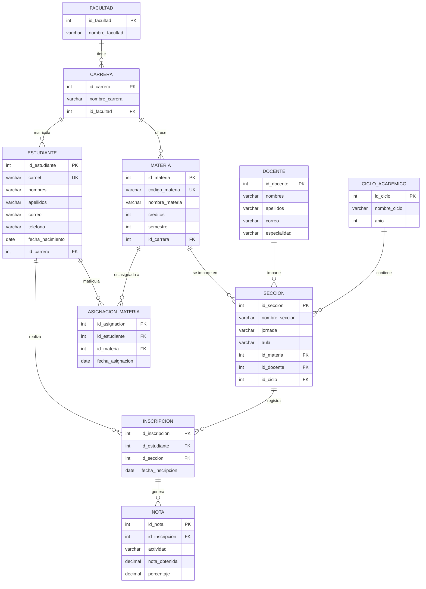
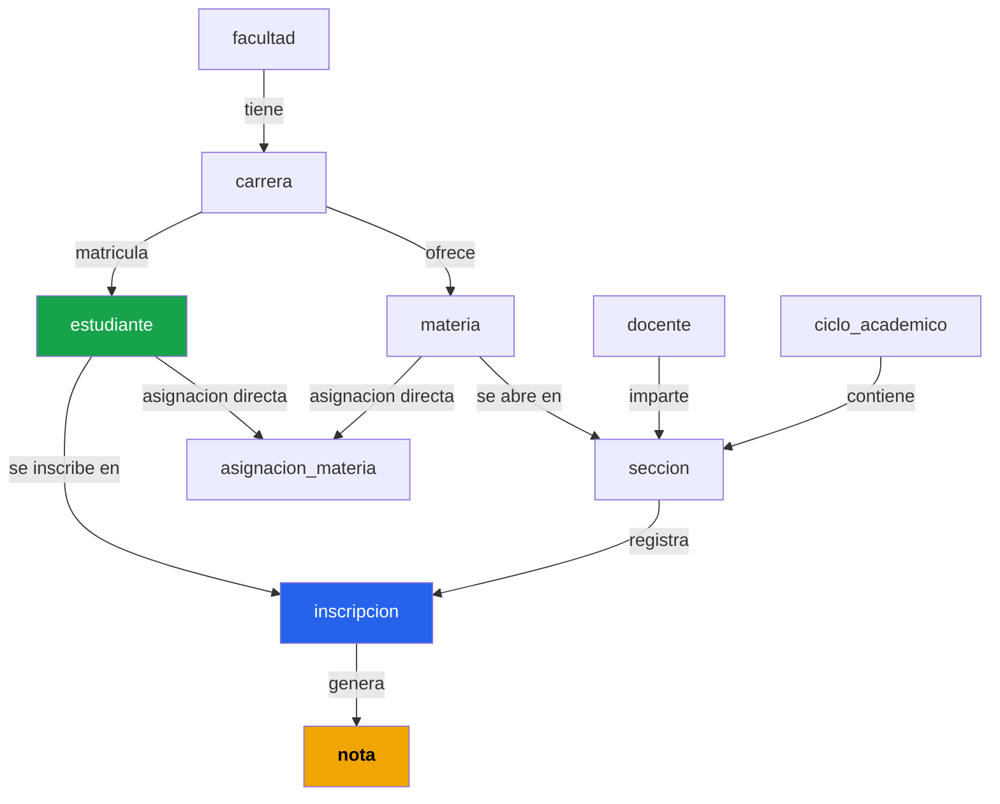

# Documentación — Sistema de Gestión de Notas Universitarias

**Tema:** Gestión de Notas  
**Proyecto:** ProyectoFinal (C++/CLR + MySQL)  
**Base de datos:** `gestion_notas_universidad`

---

## 1. Diagrama Entidad-Relación (ERD)



---

## 2. Descripción de cada tabla

### 2.1 `facultad`

| Columna | Tipo | Restricción | Descripción |
|---|---|---|---|
| `id_facultad` | INT | PK, AUTO_INCREMENT | Identificador único de la facultad |
| `nombre_facultad` | VARCHAR(100) | NOT NULL | Nombre de la facultad (ej. "Ingeniería y Arquitectura") |

**Propósito:** Representa la unidad académica más alta de la institución. Agrupa las carreras universitarias bajo una facultad.  
**Relaciones:** Una facultad puede tener muchas **carreras** (`1:N` con `carrera`).

---

### 2.2 `carrera`

| Columna | Tipo | Restricción | Descripción |
|---|---|---|---|
| `id_carrera` | INT | PK, AUTO_INCREMENT | Identificador único de la carrera |
| `nombre_carrera` | VARCHAR(100) | NOT NULL | Nombre de la carrera (ej. "Ingeniería en Sistemas") |
| `id_facultad` | INT | FK → `facultad` | Facultad a la que pertenece la carrera |

**Propósito:** Define los programas académicos disponibles. Sirve como punto de unión entre la facultad, las materias y los estudiantes.  
**Relaciones:** Pertenece a una **facultad**; puede tener muchas **materias** y muchos **estudiantes** inscritos.

---

### 2.3 `estudiante`

| Columna | Tipo | Restricción | Descripción |
|---|---|---|---|
| `id_estudiante` | INT | PK, AUTO_INCREMENT | Identificador único del estudiante |
| `carnet` | VARCHAR(20) | NOT NULL, UNIQUE | Número de carnet (único por estudiante) |
| `nombres` | VARCHAR(100) | NOT NULL | Nombre(s) del estudiante |
| `apellidos` | VARCHAR(100) | NOT NULL | Apellido(s) del estudiante |
| `correo` | VARCHAR(100) | — | Correo electrónico |
| `telefono` | VARCHAR(20) | — | Número de teléfono |
| `fecha_nacimiento` | DATE | — | Fecha de nacimiento |
| `id_carrera` | INT | FK → `carrera` | Carrera en la que está inscrito |

**Propósito:** Almacena la información personal y académica de cada alumno del sistema. Es la entidad central del tema de gestión de notas.  
**Relaciones:** Pertenece a una **carrera**; se puede inscribir en múltiples **secciones** (a través de `inscripcion`) y puede tener asignaciones directas de materias (a través de `asignacion_materia`).


> El `carnet` es un identificador de negocio único (UNIQUE KEY), mientras que `id_estudiante` es el identificador técnico de base de datos.

---

### 2.4 `docente`

| Columna | Tipo | Restricción | Descripción |
|---|---|---|---|
| `id_docente` | INT | PK, AUTO_INCREMENT | Identificador único del docente |
| `nombres` | VARCHAR(100) | NOT NULL | Nombres del docente |
| `apellidos` | VARCHAR(100) | NOT NULL | Apellidos del docente |
| `correo` | VARCHAR(100) | — | Correo institucional |
| `especialidad` | VARCHAR(100) | — | Área académica del docente (ej. "Programación y Base de Datos") |

**Propósito:** Registra a los profesores que imparten clases. Se asocia a secciones específicas, lo que permite identificar quién es responsable de una materia en un ciclo determinado.  
**Relaciones:** Un docente puede impartir múltiples **secciones** (`1:N` con `seccion`).

---

### 2.5 `materia`

| Columna | Tipo | Restricción | Descripción |
|---|---|---|---|
| `id_materia` | INT | PK, AUTO_INCREMENT | Identificador único de la materia |
| `codigo_materia` | VARCHAR(20) | NOT NULL, UNIQUE | Código académico (ej. "INF-101") |
| `nombre_materia` | VARCHAR(100) | NOT NULL | Nombre completo (ej. "Programación I") |
| `creditos` | INT | NOT NULL | Número de créditos académicos |
| `semestre` | INT | NOT NULL | Semestre en que se imparte normalmente |
| `id_carrera` | INT | FK → `carrera` | Carrera a la que pertenece la materia |

**Propósito:** Catálogo de las asignaturas académicas de la institución. Cada materia pertenece a una carrera y puede abrirse en múltiples secciones por ciclo.  
**Relaciones:** Pertenece a una **carrera**; puede tener múltiples **secciones** y ser objeto de **asignaciones directas** a estudiantes.

---

### 2.6 `ciclo_academico`

| Columna | Tipo | Restricción | Descripción |
|---|---|---|---|
| `id_ciclo` | INT | PK, AUTO_INCREMENT | Identificador único del ciclo |
| `nombre_ciclo` | VARCHAR(50) | NOT NULL | Denominación del ciclo (ej. "Ciclo I") |
| `anio` | INT | NOT NULL | Año lectivo (ej. 2026) |

**Restricción adicional:** `UNIQUE(nombre_ciclo, anio)` — no puede haber dos veces el mismo ciclo en el mismo año.

**Propósito:** Define los períodos académicos del año (semestres o ciclos). Organiza temporalmente la apertura de secciones.  
**Relaciones:** Un ciclo puede contener múltiples **secciones** (`1:N` con `seccion`).

---

### 2.7 `seccion`

| Columna | Tipo | Restricción | Descripción |
|---|---|---|---|
| `id_seccion` | INT | PK, AUTO_INCREMENT | Identificador único de la sección |
| `nombre_seccion` | VARCHAR(20) | NOT NULL | Nombre o letra de la sección (ej. "A", "B") |
| `jornada` | VARCHAR(50) | — | Jornada de estudio (ej. "Matutina", "Vespertina") |
| `aula` | VARCHAR(20) | — | Aula asignada (ej. "A-101") |
| `id_materia` | INT | FK → `materia` | Materia que se imparte en esta sección |
| `id_docente` | INT | FK → `docente` | Docente responsable de la sección |
| `id_ciclo` | INT | FK → `ciclo_academico` | Ciclo académico al que pertenece |

**Propósito:** Representa la apertura real de una materia en un ciclo concreto, con un docente y horario específicos. Es el puente entre el catálogo de materias y la inscripción de los alumnos.  
**Relaciones:** Depende de **materia**, **docente** y **ciclo_academico**; puede tener múltiples **inscripciones** de estudiantes.

---

### 2.8 `inscripcion`

| Columna | Tipo | Restricción | Descripción |
|---|---|---|---|
| `id_inscripcion` | INT | PK, AUTO_INCREMENT | Identificador único de la inscripción |
| `id_estudiante` | INT | FK → `estudiante` | Estudiante que se inscribe |
| `id_seccion` | INT | FK → `seccion` | Sección en la que se inscribe |
| `fecha_inscripcion` | DATE | NOT NULL | Fecha en que se realizó la inscripción |

**Restricción adicional:** `UNIQUE(id_estudiante, id_seccion)` — un estudiante no puede inscribirse dos veces en la misma sección.

**Propósito:** Registra el vínculo entre un estudiante y una sección específica. Esta tabla es la base para el registro de notas: **todas las notas están ligadas a una inscripción**, no directamente a un estudiante.  
**Relaciones:** Conecta **estudiante** con **seccion**; es la tabla padre de **nota**.


> Esta tabla es la más importante del flujo de notas: `Estudiante → Inscripcion → Nota` es la cadena principal de trazabilidad académica.

---

### 2.9 `asignacion_materia`

| Columna | Tipo | Restricción | Descripción |
|---|---|---|---|
| `id_asignacion` | INT | PK, AUTO_INCREMENT | Identificador único de la asignación |
| `id_estudiante` | INT | FK → `estudiante` | Estudiante asignado |
| `id_materia` | INT | FK → `materia` | Materia asignada |
| `fecha_asignacion` | DATE | NOT NULL | Fecha en que se realizó la asignación |

**Restricción adicional:** `UNIQUE(id_estudiante, id_materia)` — un estudiante no puede ser asignado dos veces a la misma materia.

**Propósito:** Permite asignar directamente una materia a un estudiante (sin pasar por la sección). Es usada en el módulo **AsignacionForm** para la administración curricular independiente.  
**Relaciones:** Conecta **estudiante** con **materia** directamente.

---

### 2.10 `nota`

| Columna | Tipo | Restricción | Descripción |
|---|---|---|---|
| `id_nota` | INT | PK, AUTO_INCREMENT | Identificador único de la nota |
| `id_inscripcion` | INT | FK → `inscripcion` | Inscripción a la que pertenece la nota |
| `actividad` | VARCHAR(100) | NOT NULL | Nombre de la actividad evaluada (ej. "Tarea 1", "Examen Parcial") |
| `nota_obtenida` | DECIMAL(5,2) | NOT NULL, CHECK 0–100 | Calificación obtenida por el estudiante |
| `porcentaje` | DECIMAL(5,2) | NOT NULL, CHECK 0–100 | Peso porcentual de la actividad sobre la nota final |

**Restricciones CHECK:**
- `nota_obtenida` debe estar entre **0 y 100**
- `porcentaje` debe estar entre **0 y 100**

**Propósito:** Es la tabla central del sistema. Registra cada evaluación parcial del estudiante en una materia específica. Sobre esta tabla se calculan todos los indicadores académicos del sistema.  
**Relaciones:** Depende de **inscripcion** (y transitivamente de estudiante y sección).


> El **promedio ponderado** real se calcula como `SUM(nota_obtenida * porcentaje / 100)`. Las consultas de informe general usan `AVG(nota_obtenida)` como simplificación.

---

## 3. Clases del Modelo Orientado a Objetos

El proyecto implementa las clases del tema en C++/CLR, definidas en [`ClasesModelo.h`](file:///c:/Users/milto/source/repos/ProyectoFinal/ProyectoFinal/ClasesModelo.h):

| Clase | Archivo | Tabla BD equivalente | Rol |
|---|---|---|---|
| `Estudiante` | ClasesModelo.h | `estudiante` | Encapsula los datos del alumno |
| `Materia` | ClasesModelo.h | `materia` | Encapsula los datos de una asignatura |
| `Nota` | ClasesModelo.h | `nota` | Encapsula una calificación puntual |
| `CModelo` *(GestorNotas)* | Controlador.h | — | Capa de acceso a datos y lógica de negocio |
| `Informe` | ClasesModelo.h | — (resultado calculado) | Encapsula el resultado del informe por estudiante |

### Clase `CModelo` — Métodos de cálculo (GestorNotas)

La clase [`CModelo`](file:///c:/Users/milto/source/repos/ProyectoFinal/ProyectoFinal/Controlador.h) actúa como el **GestorNotas** del tema. Implementa los tres cálculos requeridos:

| Método | Tipo retorno | Cálculo |
|---|---|---|
| `promedioEstudiantes()` | `DataTable^` | `AVG(nota_obtenida)` agrupado por estudiante |
| `numeroAprobados()` | `int` | Conteo de estudiantes con `AVG(nota) >= 61` |
| `notaMaxima()` | `float` | `MAX(nota_obtenida)` global |
| `notaMinima()` | `float` | `MIN(nota_obtenida)` global |
| `informeGeneral()` | `DataTable^` | Promedio + máxima + mínima + estado por estudiante |
| `promedioPorMateria(id)` | `DataTable^` | Promedio filtrado por materia |
| `numeroAprobadosPorMateria(id)` | `int` | Aprobados filtrado por materia |

---

## 4. Consultas SQL implementadas

### 4.1 Promedio de notas por estudiante
```sql
SELECT
    e.id_estudiante,
    e.nombres,
    e.apellidos,
    AVG(n.nota_obtenida) AS promedio
FROM estudiante e
INNER JOIN inscripcion i ON e.id_estudiante = i.id_estudiante
INNER JOIN nota n        ON i.id_inscripcion = n.id_inscripcion
GROUP BY e.id_estudiante, e.nombres, e.apellidos;
```

### 4.2 Número de aprobados (nota promedio ≥ 61)
```sql
SELECT COUNT(*) AS numero_aprobados
FROM (
    SELECT e.id_estudiante, AVG(n.nota_obtenida) AS promedio
    FROM estudiante e
    INNER JOIN inscripcion i ON e.id_estudiante = i.id_estudiante
    INNER JOIN nota n        ON i.id_inscripcion = n.id_inscripcion
    GROUP BY e.id_estudiante
    HAVING AVG(n.nota_obtenida) >= 61
) AS aprobados;
```

### 4.3 Nota máxima y mínima
```sql
SELECT MAX(nota_obtenida) AS nota_maxima FROM nota;
SELECT MIN(nota_obtenida) AS nota_minima FROM nota;
```

### 4.4 Informe general por estudiante
```sql
SELECT
    e.carnet,
    CONCAT(e.nombres, ' ', e.apellidos) AS estudiante,
    AVG(n.nota_obtenida)  AS promedio,
    MAX(n.nota_obtenida)  AS nota_maxima,
    MIN(n.nota_obtenida)  AS nota_minima,
    CASE
        WHEN AVG(n.nota_obtenida) >= 61 THEN 'APROBADO'
        ELSE 'REPROBADO'
    END AS estado
FROM estudiante e
INNER JOIN inscripcion i ON e.id_estudiante = i.id_estudiante
INNER JOIN nota n        ON i.id_inscripcion = n.id_inscripcion
GROUP BY e.id_estudiante, e.carnet, e.nombres, e.apellidos;
```

---

## 5. Resumen de relaciones entre tablas




> La tabla **`nota`** (marcada en amarillo) es la tabla destino de todos los cálculos académicos del sistema. El camino de trazabilidad es siempre: `nota → inscripcion → estudiante / seccion → materia`.
